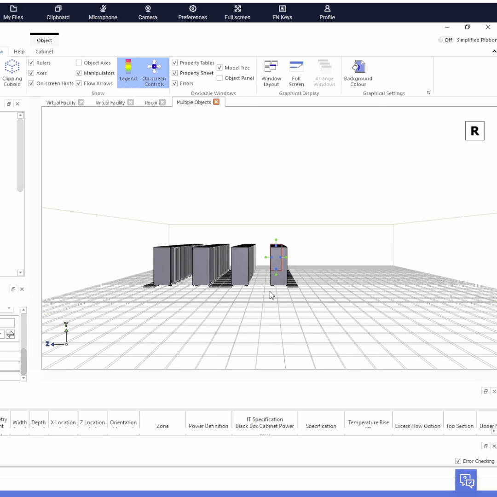

# 🌿 GreenLeaf DC-01

## AI Data Center Thermal Simulation

> Designing sustainable AI infrastructure through intelligent thermal engineering.

<p align="center">
  
</p>

---

## Project Overview

GreenLeaf DC-01 is the first prototype in the GreenLeaf research series, a collection of experimental AI data center designs focused on improving energy efficiency, thermal management, and sustainable infrastructure.

This project demonstrates the design and simulation of a small AI server room using **Cadence Reality DC Design Essentials**, where rack placement, hot/cold aisle containment, airflow, and thermal performance are modeled and analyzed using Computational Fluid Dynamics (CFD).

The long-term vision of GreenLeaf is to explore innovative approaches to environmentally responsible AI infrastructure.

---

# Objectives

- Design a functional AI server room
- Model hot and cold aisle containment
- Simulate rack thermal behavior
- Evaluate cooling efficiency
- Build a foundation for future GreenLeaf research

---

# Features

- ✅ AI Server Rack Layout
- ✅ Hot / Cold Aisle Design
- ✅ CFD Thermal Simulation
- ✅ 3D Facility Modeling
- ✅ Rack Power Configuration
- ✅ Thermal Visualization
- ✅ Engineering Documentation

---

# Engineering Workflow

```text
Concept
    │
    ▼
Facility Layout
    │
    ▼
Rack Placement
    │
    ▼
Power Configuration
    │
    ▼
Cooling Configuration
    │
    ▼
CFD Simulation
    │
    ▼
Thermal Analysis
    │
    ▼
Optimization
```

---

# Software

- Cadence Reality DC Design Essentials
- Git
- GitHub

---

# Skills Demonstrated

- Data Center Architecture
- Thermal Engineering
- Computational Fluid Dynamics (CFD)
- AI Infrastructure Design
- Power Planning
- Rack Layout Optimization
- 3D Engineering Modeling
- Engineering Documentation

---

# Results

This baseline prototype successfully demonstrates:

- Functional AI rack layout
- Hot/cold aisle containment strategy
- Rack temperature simulation
- Thermal airflow analysis
- 3D visualization of the facility

GreenLeaf DC-01 serves as the foundation for future experimental data center research.

---

# Future Improvements

- Renewable energy integration
- Liquid cooling simulation
- Waterless cooling research
- AI workload optimization
- FPGA accelerator clusters
- Edge AI deployment models
- Autonomous cooling control
- Digital twin monitoring

---

# GreenLeaf Research Roadmap

| Project | Status |
|---------|--------|
| 🌿 GreenLeaf DC-01 Baseline Thermal Design | ✅ Complete |
| 🌞 GreenLeaf DC-02 Solar Assisted Cooling | ⏳ Planned |
| ⚡ GreenLeaf DC-03 Smart Power Distribution | ⏳ Planned |
| 🧠 GreenLeaf DC-04 AI Cooling Optimization | ⏳ Planned |
| 💧 GreenLeaf DC-05 Waterless Cooling Research | ⏳ Planned |
| 🔲 GreenLeaf DC-06 FPGA AI Cluster | ⏳ Planned |
| 🛰️ GreenLeaf DC-07 Edge Data Center | ⏳ Planned |

---

# Repository Structure

```
GreenLeaf-DC-01/
│
├── README.md
├── greenleaf-demo.gif
├── GreenLeaf-DC-01.room
└── documentation/
```

---

# Research Focus

GreenLeaf is an independent engineering research initiative exploring the intersection of:

- Sustainable Computing
- AI Infrastructure
- FPGA Systems
- Thermal Engineering
- Applied Physics
- Energy Efficient Computing

---

## Author

**A'Yana Leonard**

Applied Mathematics & Physics Student

FPGA & AI Infrastructure Research

U.S. Army Veteran (Quartermaster Corps)

Independent Engineering Research

---

*"Building the next generation of sustainable AI infrastructure."*
